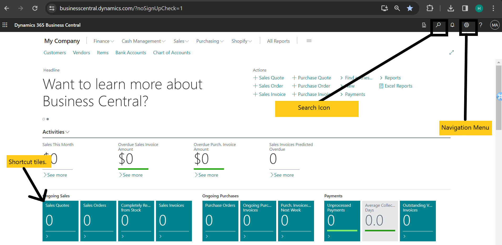

:::note Business Central

    

        <h1>Welcome to Dynamics 365 Business Central</h1>
        
Let's get started with <strong>Dynamics 365 Business Central</strong>. 🚀

    

:::

## Introduction to Business Central

Welcome to Microsoft Dynamics 365 Business Central! This section will provide you with an overview of the platform, its key features, system requirements, and how to access and navigate Business Central.

### Overview

Microsoft Dynamics 365 Business Central is a comprehensive business management solution designed to streamline operations, automate processes, and empower decision-making. With Business Central, you can manage finances, sales, service, and operations efficiently, all in one integrated platform.

### Key Features

Versatility: Business Central empowers companies to manage multiple facets of their operations, from finance and manufacturing to sales, shipping, project management, and services.

- **Customization**: Tailor Business Central to meet the specific needs of your organization and industry. Easily add functionalities relevant to your region of operation and specialized requirements.

- **Implementation**: Business Central is designed for rapid deployment and ease of configuration. Its user-friendly interface ensures a smooth transition, allowing you to start benefiting from its features quickly.

- **Innovation**: The simplicity of Business Central guides innovations in product design, development, and implementation, enhancing usability and driving efficiency.

### System Requirements

Before you get started with Business Central, ensure that your system meets the following requirements:

- **Supported Browsers:** Business Central is compatible with modern web browsers such as Google Chrome, Mozilla Firefox, Microsoft Edge, and Safari.
- **Internet Connection:** A stable internet connection is required to access Business Central.
- **Supported Devices:** Business Central can be accessed from desktop computers, laptops, tablets, and mobile devices.
- **User Licenses:** Make sure you have the necessary user licenses to access Business Central features based on your organization's subscription plan.

### Accessing Business Central

To access Microsoft Dynamics 365 Business Central, follow these steps:

1. **Open Your Web Browser:** Launch your preferred web browser on your device.
   
2. **Navigate to Business Central URL:** Enter the URL provided by your system administrator or Microsoft to access the Business Central login page.

3. **Enter Your Credentials:** Input your username and password provided by your system administrator.

4. **Sign 🚀 Tip: Save time by bookmarking the Purchase Quotes section for quick access in the future!d in, you'll find Business Central's intuitive and user-friendly interface easy to navigate. Here are some key navigation points:

- **Navigation Menu:** Use the navigation menu on the right-hand side to access different modules(Role Centers) and functionalities within Business Central.
- **Search Bar:** Utilize the search bar at the top to quickly find specific pages, reports, or tasks.
- **Shortcut Tiles:** Customize your dashboard with shortcut tiles to frequently accessed features.

**Congratulations! You're now equipped with the knowledge to begin your journey with Microsoft Dynamics 365 Business Central.**
