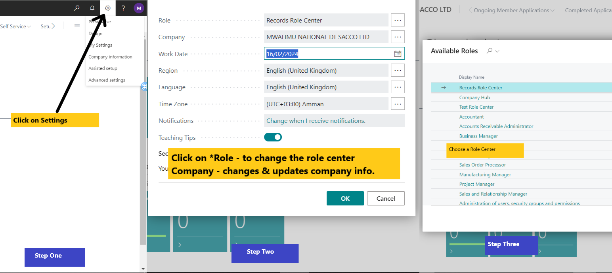

:::note Business Central

    

        <h1>Getting Started with Dynamics 365 Business Central</h1>
        
Get to know <strong>Dynamics 365 Business Central</strong>. 🤗

    

:::

## Quick Start Guide

Welcome to Dynamics 365 Business Central! This quick start guide will help you get started with the basic features of the platform.

### 1. Sign In to Business Central

To access your Dynamics 365 Business Central account:

- Open your web browser and navigate to the **Business Central login page**.
- Enter your **username** and **password**.
- Click **Sign In** to access your account.

### 2. Navigate the Dashboard / Role Center

Once logged in, you'll be taken to the Business Central dashboard. Here you can:
- View key metrics and insights about your business.
- Access various role centers such as Finance, Credit, Business Loans, Treasury & Investment, Legal, etc.

### 3. Setting Up Your Company

Before you can start using Business Central, you'll need to set up your company profile:
- Click on the **Company Settings** or **Settings** menu option.
- Follow the on-screen instructions to enter your company information, such as name, address, and fiscal year settings.

:::note Note
- Setting up your company profile accurately is crucial for proper functioning and reporting within Business Central.
- Ensure that you enter correct and up-to-date information to avoid any discrepancies in your financial records.
:::

## Next Steps: Exploring Business Central

Now that you've completed the initial setup, let's explore more about Microsoft Dynamics 365 Business Central and delve deeper into its functionalities for your business needs.

### Setting Up Your Profile

To get started, follow these steps to set up your user profile:

1. **Navigate to User Setup:** Click on the **Settings** icon in the top-right corner, then select **My Settings**.
   
2. **Edit User Profile:** In the User Setup window, you can edit your profile information such as name, contact details, and preferences.

:::tip Tips
- Ensure that your contact information is accurate for effective communication within the system.
- Customize your preferences to tailor the Business Central interface to your needs.
:::

### Personalizing the Workspace

Customizing your workspace can improve productivity and efficiency. Here's how to personalize your Business Central environment:

1. **Access Personalization Options:** Click on the **Settings** icon in the top-right corner, then select **Personalization**.

2. **Modify Role Center:** Customize your Role Center by adding or removing tiles, rearranging elements, and configuring shortcuts to frequently used features.

:::note Note
- Role Centers provide a personalized dashboard based on your role in the organization, offering quick access to relevant tasks and information.
- Experiment with different layouts to find what works best for you.
:::

### Understanding Role Centers

Role Centers are tailored dashboards designed to optimize productivity for specific roles within the organization. Here's how to navigate and understand Role Centers:

1. **Access Role Center:** From the navigation menu, click on **Home** to access your Role Center.

2. **Explore Features:** Familiarize yourself with the different sections and tiles available on your Role Center. Each tile represents a specific task or area of responsibility.

:::warning Warning
- Be cautious when making changes to your Role Center, as it may affect your workflow and productivity.
- Consult with your system administrator or supervisor before making significant modifications.
:::

Congratulations! You've successfully completed the initial setup and customization of your Business Central environment. Now you're ready to dive into the various features and functionalities offered by Business Central.