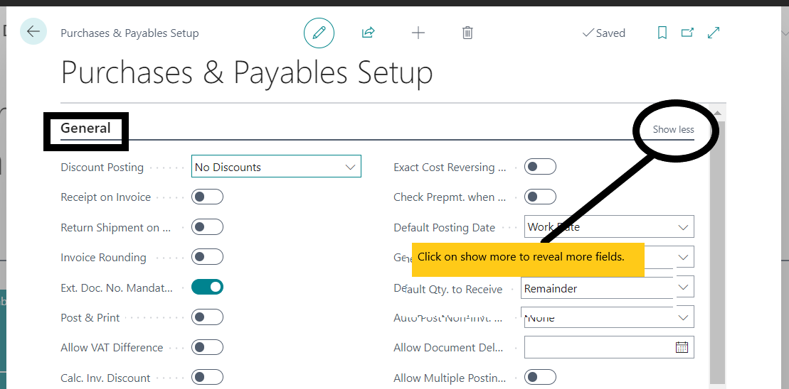

:::note Business Central

    

        <h2>Setting Up the Procurement Module</h2>
        
Hello! let's get started with setting up the procurement section! This guide will walk you through the necessary steps to configure and customize the procurement module in <strong>Dynamics 365 Business Central</strong>. 🚀

    

:::

## Configuring Procurement Settings
---

### General Setup Options
---

1. Navigate to the **General Setup** page:
   - Click on the Settings icon.
   - Select General Setup from the menu.
2. Customize general options:
   - Configure settings such as **discounts** and **rounding preferences**.

### Purchase and Payables Setup
---

1. Access the Purchase & Payables Setup page:
   - Click on the search icon, enter  ***purchases and payables*** and then choose the related list.
   - Select Purchase & Payables Setup from the menu.

   A page will appear as shown below:
   

2. Define purchase values:
   - Set up number series for vendors and purchase documents.

:::tip
Hover around the fields to get a brief description of each.
In cases where there is a dropdown, choose **New** to create a new field or select an existing one. Some fields require special attention, as they change depending on how other fields are set. For instance, the **Calc.** **Inv.** **Disc.** per **VAT/Tax ID** field determines how invoice discounts are calculated based on tax identifiers.
:::

### Vendor Management Configuration
---

1. Navigate to the **Order Planning** section:
   - Alternatively, click on the search bar and search for **Vendors**.
   - Select Vendor/Vendor List from the menu.
   
2. Set up vendor management parameters:
   - Configure vendor categories, payment terms, and other relevant information.

## Defining Purchase Policies and Procedures
---

### Establishing Purchase Policies
---

1. Define purchase policies:
   - Establish guidelines for procurement activities, including purchasing thresholds and preferred suppliers.

### Defining Approval Workflows
---

2. Implement approval workflows:
   - Define approval rules based on factors such as **purchase amount** and **vendor category**.

## Setting Up Vendors
---

### Register New Vendors
---
- Vendor cards contain the information required to buy products from each vendor.
- Before registering new vendors, ensure that various **purchase codes** are set up to select from when filling in vendor cards. 
- Record any agreements regarding **discounts**, **prices**, and **payment methods** within the vendors page.

### Adding New Vendors
---

Add new vendors either manually by filling out the Vendor Card page.

**To Create a New Vendor:**

- Choose the   icon, enter **Vendors,** and select the related link. Alternatively, navigate to the **Order Planning** section in the procurement module and click on **Vendors**.
- On the Vendors page, choose **New,** and proceed to fill or change fields on the vendor card as necessary. The vendor is now registered, and the vendor card is ready for use on purchase documents.

### Deleting and Editing Vendor Information
---

Vendor information can be edited at any time, except if transactions have been posted for the vendor.

:::tip
**The vendor card automatically saves the inputted vendor details.**

## Bank Details Setup
---
### Add or Edit a Vendor Bank Account
---
- Choose the  that opens the Tell Me feature. icon, enter Vendors, and then choose the related link.
- Open the vendor card.
- Choose the Bank Details section.

From the Vendor Bank Details card, input the relevant bank account and fill in the other fields as necessary. Hover over a field to read a short description.

:::tip
Some fields are hidden until you choose the Show more action, typically because they are used rarely. Others must be added through personalization.
