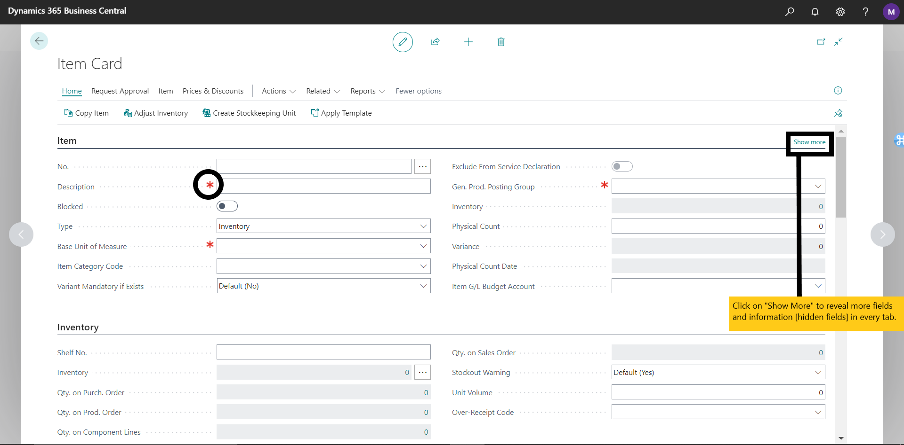

#  🛒 Order Planning
---

:::note Order Planning

    

        <h2>🛒 Order Planning </h2>
        
Objective : To efficiently plan and execute procurement processes. 🚀

    

:::

---

Order planning is a critical phase in the procurement cycle, ensuring that all necessary steps are taken to effectively acquire goods and services required for business operations. This section outlines the comprehensive process of order planning, covering items, vendors, and budgeting.

### Managing Items
---

**Navigate to *Items* within the Order Planning Section:**

- Access the Business Central dashboard.
- Locate and click on the **Items** section.

<!--  *(Add screenshot here)* -->

This section serves as a repository for all essential item-related data.

**Add or Edit Items:**

- Select **New** to add a new item to the item list/catalogue.
- Carefully edit existing items as necessary, ensuring accuracy and relevance.
- Provide comprehensive item details including description, pricing, specifications, and any other pertinent information.

**Fill in Item Details:**

- Enter the item description, ensuring clarity and specificity.
- Specify pricing details, including cost, currency, and any applicable discounts.
- Provide detailed specifications to facilitate accurate procurement decisions.

**Save Changes:**

- Upon completion of item data entry or modification, changes made on the item card are automatically saved.

### Vendor Selection and Management
---

**Access the *Vendors* Module:**

- Navigate to the main menu of Business Central.
- Locate and click on the "Vendors" module to access vendor management functionalities.

<!--  *(Add screenshot here)* -->

**Review Available Vendors:**

- Thoroughly review the list of available vendors, assessing their suitability for the organization's procurement needs.
- Evaluate vendors based on various criteria such as pricing competitiveness, product quality, delivery reliability, and past performance.

**Evaluate Vendors:**

- Conduct a comprehensive evaluation of vendors to ensure alignment with organizational requirements and standards.
- Consider factors such as pricing structures, product quality, service level agreements, and vendor reputation.

**Establish Vendor Relationships:**

- Initiate and nurture positive relationships with selected vendors.
- Negotiate favorable contracts and terms to maximize value and minimize risks.
- Maintain open communication channels to address any issues or concerns promptly.

### Budgeting for Procurement Activities
---

**Utilize Budgeting Feature:**

- Leverage the budgeting feature integrated into Business Central to allocate financial resources for procurement activities.

<!--  *(Add screenshot here)* -->

**Define Budget Categories:**

- Define clear and distinct budget categories based on the nature and scope of procurement activities.
- Categorize budgets according to relevant criteria such as departments, projects, or expenditure types.

**Set Spending Limits:**

- Establish prudent spending limits for each budget category to prevent overspending and promote fiscal responsibility.
- Consider historical spending patterns, market conditions, and strategic priorities when setting spending limits.

**Monitor Spending:**

- Continuously monitor actual spending against budgeted amounts to track financial performance and identify variances.
- Implement proactive measures to address budgetary deviations and ensure adherence to financial plans and targets.
